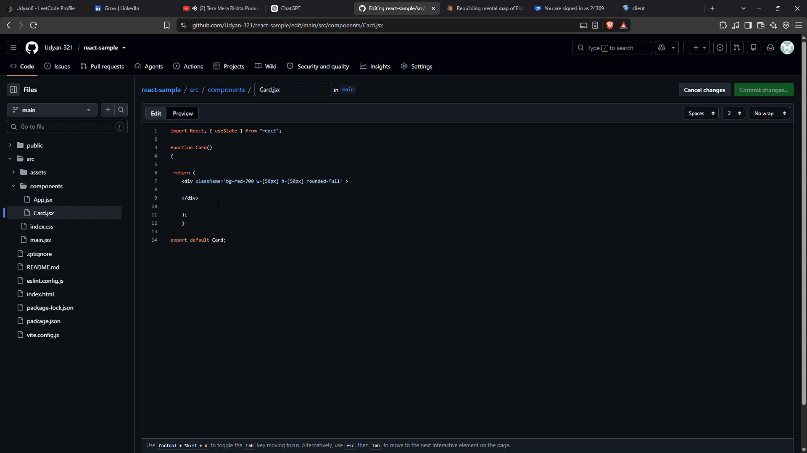

# Flow Forge

A visual, drag-and-drop automation builder for the GitHub PR lifecycle — AI-powered code review, severity-based branching, Slack alerts, and auto-comments, all orchestrated on a real job queue.



## What it does

Flow Forge lets you build PR automation workflows on a visual canvas instead of writing YAML or scripts by hand. Drag nodes, connect them, and Flow Forge runs the pipeline every time a PR event hits your repo.

- **Visual workflow builder** — drag-and-drop canvas (React Flow) for wiring up automation, no config files
- **AI code review** — every PR diff is reviewed by an LLM (Groq) and classified as `HIGH` or `LOW` severity
- **Conditional branching** — the workflow forks based on severity: one path posts a review comment straight on the PR, the other sends a Slack notification
- **Live execution view** — nodes light up on the canvas in real time as the workflow runs, via websockets
- **Multi-workflow support** — more than one workflow can independently watch the same repo

## Tech stack

**Backend:** Express, TypeScript, Prisma 7 / PostgreSQL, BullMQ + Redis, Socket.io
**Frontend:** React, Vite, @xyflow/react (React Flow)
**AI:** Groq (`openai/gpt-oss-120b`)
**Auth & security:** GitHub OAuth, JWT (httpOnly cookies), AES-256 encryption for stored access tokens
**Infra:** Docker Compose (Postgres + Redis)

## Architecture highlights

A few decisions worth calling out, since they're the part that isn't just "wired two APIs together":

- **Denormalized repo lookup.** The canvas data is stored as one JSON blob (`canvasData`) — that's the render source of truth the frontend needs to restore the UI. But webhook matching needs a fast, indexed lookup, so `repository` is also extracted into its own indexed column server-side on every save. Never trusted from the frontend directly — always pulled out of `canvasData` on the backend, so the two can't drift out of sync.

- **Structured LLM output over prose parsing.** The AI review prompt requires a `SEVERITY: HIGH` / `SEVERITY: LOW` prefix line instead of trying to string-match sentiment out of free text. More reliable, and it's the difference between "hoping the model's wording matches a regex" and actually parsing structured output.

- **Strict separation of ephemeral and persisted state.** Live execution status (which node is currently running/done/failed) is kept in a completely separate piece of state from the actual saved workflow, and only merged in at render time — never written back to the database. This was a deliberate fix after catching a real bug where UI-only data (a dropdown's live options list) was accidentally being persisted on every save.

- **One error boundary, not scattered try/catches.** Individual node handlers throw naturally on bad state instead of catching internally. The workflow's traversal loop has a single try/catch that's the one source of truth for marking a run as failed and emitting that over the socket — keeps failure handling predictable instead of spread across every handler.

## Setup / run locally

```bash
git clone https://github.com/Udyan-321/Flow-forge.git
cd Flow-forge

# start Postgres + Redis
docker compose up -d

# backend
cd server
npm install
cp .env.example .env   # fill in your actual values
npx prisma generate
npx prisma migrate dev
npm run dev

# frontend
cd ../client
npm install
npm run dev
```

Required env vars (see `server/.env.example`): `DATABASE_URL`, `GITHUB_CLIENT_ID`, `GITHUB_CLIENT_SECRET`, `GITHUB_CALLBACK_URL`, `GITHUB_WEBHOOK_SECRET`, `GROQ_API_KEY`, `JWT_SECRET`, `ENCRYPTION_KEY`, `PORT`, `SERVER_URL`, `CLIENT_URL`.

You'll need a GitHub OAuth app and a Groq API key to run this end-to-end. `ENCRYPTION_KEY` and `JWT_SECRET` can be generated with:
```bash
node -e "console.log(require('crypto').randomBytes(32).toString('hex'))"
```

## Known limitations

Being upfront about what this isn't, yet:

- No chunking or parallelization of job processing — fine at the scale I tested, not built for high-volume repos
- No transaction handling across multi-step writes
- Branching is binary (severity-based) only — no general-purpose N-way branching or node-connection rules
- Cross-session websocket isolation (making sure one user's live run updates never leak to another user's browser tab) has been reviewed in code but not yet formally load-tested with two concurrent real sessions

## What I'd add next

- General node-connection restrictions (a requires/provides model between node types)
- Horizontal scaling of the BullMQ worker for concurrent webhook bursts
- N-way branching beyond severity (e.g. by file type, PR size)

---

Built by Udyan Shahi — a project to get hands-on with Docker, Postgres, Prisma, Redis, BullMQ, and real-time systems end-to-end.